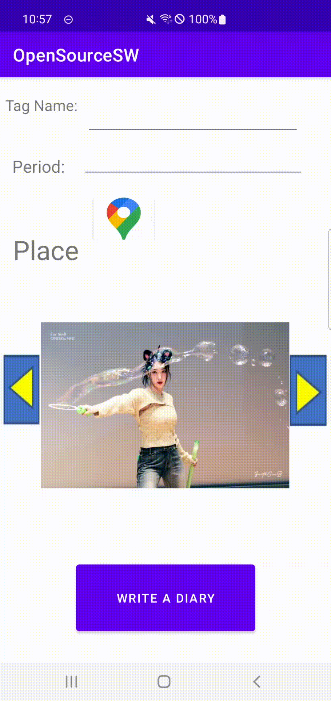

# android_app_ui
오픈소스SW기여 프로젝트 레포지토리

## Functions

- [Search images using tags](#tags-Search-images-using-tags)
- [Search images using date taken](#date-taken-Search-images-using-date-taken)
- [Search images using place taken](#place-taken-Search-images-using-place-taken)
- [Move to previous image/next image & Move to Diary writing screen](#move-Move-to-previous-image-next-image-Move-to-Diary-writing-screen)
- [Diary store/modify/delete](#dsmd-Diary-store-modify-delete)
- [Select Keyword from diary and add tag](#keywordtag-Select-Keyword-from-diary-and-add-tag)

@@@ Search images using tags @@@

@@@ Search images using date taken @@@

@@@ Search images using place taken @@@

@@@ Move to previous image/next image & Move to Diary writing screen @@@

@@@ Diary store/modify/delete @@@

@@@ Select Keyword from diary and add tag @@@

